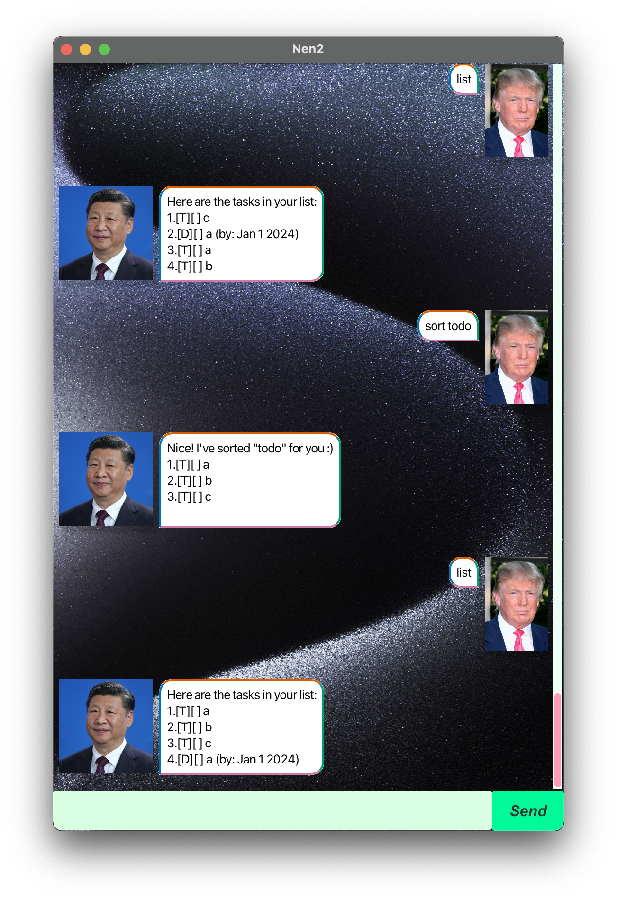

# Nen2 User Guide


Nen2 is a smart chatbot that helps you manage tasks, events, and deadlines with ease. It can organize your to-do lists, and sort events and deadlines by date, ensuring you stay on top of your schedule.
## Adding Todos

You can use `todo {description}` command to ask Nen2 to add a todo to your tasks list

Example: `Todo abc` 
```
Got it. I've added this task:
[T][] abc
Now you have 1 tasks in the list.
```

## Adding Deadlines

You can use `deadline {description} /by {date(yyyy-mm-dd)}` command to ask Nen2 to add a deadline to your tasks list

Example: `deadline abc /by 2024-01-01` 
```
Got it. I've added this task:
[D][] abc (by: Jan 1 2024)
Now you have 2 tasks in the list.
```

## Adding Events

You can use `event {description} /from {date(yyyy-mm-dd)} /to {date(yyyy-mm-dd)}` command to ask Nen2 to add an event to your tasks list

Example: `event abc /from 2024-01-01 /to 2024-01-02` 
```
Got it. I've added this task:
[E][] abc (from: Jan 1 2024 to: Jan 2 2024)
Now you have 3 tasks in the list.
```

## Mark task

You can use `mark {number}` command to ask Nen2 to mark the task of given number as done

Example: `mark 1`
```
Nice! I've marked this task as done:
[T][X] abc
```

## Unmark task

You can use `unmark {number}` command to ask Nen2 to mark the task of given number as not done

Example: `unmark 1`
```
Ok, I've marked this task as not done yet:
[T][] abc
```

## Delete task

You can use `delete {number}` command to ask Nen2 to delete the task of given number

Example: `delete 1`
```
Noted. I've removed this task:
[T][] abc
Now you have 2 tasks in the list.
```

## List tasks

You can use `list` command to ask Nen2 to list out all tasks

Example: `list`
```
Here are the tasks in your list:
1.[T][] b
2.[E][] abc (from: Jan 1 2024 to: Jan 2 2024)
3.[T][] a
4.[T][] c
```

## Sort tasks

You can use `sort {type of task}` command to ask Nen2 to sort the given type of task

Example:\
`list`
```
Here are the tasks in your list:
1.[T][] b
2.[E][] abc (from: Jan 1 2024 to: Jan 2 2024)
3.[T][] a
4.[T][] c
```
`sort todo`
```
Nice! I've sorted "todo" for you :)
1.[T][] a
2.[T][] b
3.[T][] c
```
`list`
```
Here are the tasks in your list:
1.[T][] a
2.[T][] b
3.[T][] c
4.[E][] abc (from: Jan 1 2024 to: Jan 2 2024)
```
## Find task

You can use `find {keyword}` command to ask Nen2 to find tasks which contain the given keyword

Example:\
`list`
```
Here are the tasks in your list:
1.[T][] b a c
3.[T][] ba c
4.[T][] c a
```
`find a`
```
Here are the matching tasks in your list:
1.[T][] b a c
2.[T][] c a
